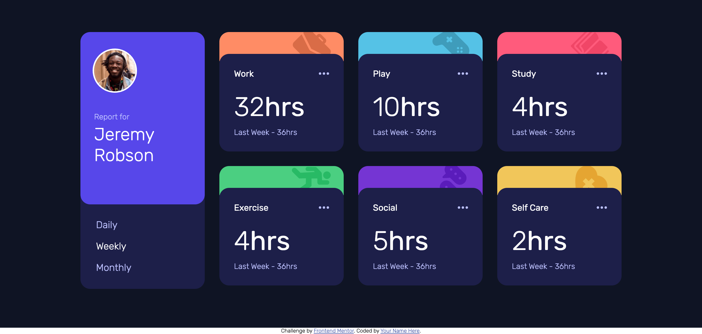

# Frontend Mentor - Time tracking dashboard solution

This is a solution to the [Time tracking dashboard challenge on Frontend Mentor](https://www.frontendmentor.io/challenges/time-tracking-dashboard-UIQ7167Jw). Frontend Mentor challenges help you improve your coding skills by building realistic projects. 

## Table of contents

- [Overview](#overview)
  - [The challenge](#the-challenge)
  - [Screenshot](#screenshot)
  - [Links](#links)
- [My process](#my-process)
  - [Built with](#built-with)
  - [What I learned](#what-i-learned)
  - [Continued development](#continued-development)
  - [Useful resources](#useful-resources)
- [Author](#author)
- [Acknowledgments](#acknowledgments)

**Note: Delete this note and update the table of contents based on what sections you keep.**

## Overview

### The challenge

Users should be able to:

- View the optimal layout for the site depending on their device's screen size
- See hover states for all interactive elements on the page
- Switch between viewing Daily, Weekly, and Monthly stats

### Screenshot

### Links

- Solution URL: [Add solution URL here](https://github.com/HusamAjour/time-tracking-dashboard)
- Live Site URL: [Add live site URL here](https://time-tracking-dashboard.husamajour.dev/)

## My process

### Built with

- Semantic HTML5 markiup
- CSS custom propertes
- Flexbox

### What I learned

Use this section to recap over some of your major learnings while working through this project. Writing these out and providing code samples of areas you want to highlight is a great way to reinforce your own knowledge.

To see how you can add code snippets, see below:

I got the chance to practise flexbox more and managed to use some JavaScript to handle to styling.

### Continued development

I'll try to do the same design but using CSS Grid instead of Flexbox. Might also make it an interactive app with login and other features and connection to a database.

### Useful resources

- [w3schools](https://www.w3schools.com/) - The website that helps all developers with all levels! I used it to review some JavaScript and CSS rules.

## Author

<!-- - Website - [Add your name here](https://www.your-site.com) -->
- Frontend Mentor - [@HusamAjour](https://www.frontendmentor.io/profile/HusamAjour)
- Twitter - [@HusamAjour](https://twitter.com/HusamAjour)

